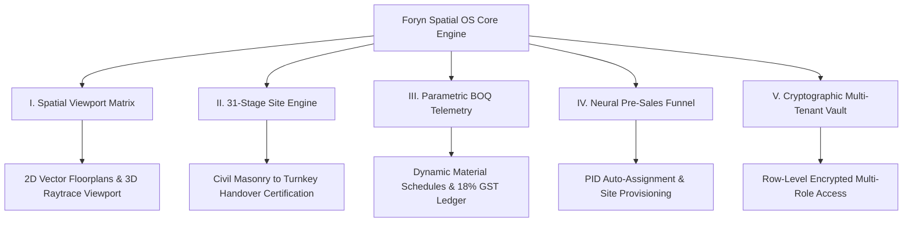

<div align="center">

  <br />

  <svg width="120" height="120" viewBox="0 0 120 120" fill="none" xmlns="http://www.w3.org/2000/svg">
    <rect width="120" height="120" rx="32" fill="#0F1428"/>
    <path d="M30 30H90M30 30V90M30 60H70" stroke="#D64062" stroke-width="8" stroke-linecap="round" stroke-linejoin="round"/>
    <circle cx="90" cy="30" r="5" fill="#D64062"/>
    <circle cx="70" cy="60" r="5" fill="#D64062"/>
    <line x1="15" y1="60" x2="105" y2="60" stroke="rgba(255,255,255,0.06)" stroke-width="2" stroke-dasharray="4 4"/>
    <line x1="60" y1="15" x2="60" y2="105" stroke="rgba(255,255,255,0.06)" stroke-width="2" stroke-dasharray="4 4"/>
  </svg>

  <br />

  # **foryn**
  ### **SPATIAL ARCHITECTURE & CAD OPERATING SYSTEM**

  `v2.4.0 • CLASSIFIED ENTERPRISE MANIFESTO`

  <br />

  [](https://github.com/Kanishk0107/Foryn)
  [](https://github.com/Kanishk0107/Foryn)
  [](https://github.com/Kanishk0107/Foryn)
  [](https://github.com/Kanishk0107/Foryn)

  <br />

</div>

---

> [!IMPORTANT]
> **RESTRICTED INTELLECTUAL PROPERTY**
> This repository contains the proprietary spatial architecture kernel, CAD viewport engine, and 31-stage physical site execution telemetry for **Foryn Living Pvt. Ltd.** Access is restricted to authorized systems architects, lead design engineers, and executive partners.

---

## 🏛️ Executive Abstract

Traditional architectural practice remains fragmented across disconnected vectors—isolated CAD drawings, manual Bill of Quantities (BOQ) spreadsheets, unverified site progress reports, and disjointed financial ledgers.

**Foryn OS** represents a fundamental shift. It is a **Unified Spatial Architecture Operating System** engineered to collapse the boundary between digital design intent and physical site execution. 

By binding 2D/3D CAD vector geometry, real-time parametric BOQ costing, 31-stage deterministic site gate certification, and bank-grade GST financial telemetry into a single synchronized state engine, Foryn OS delivers absolute operational control across multi-crore luxury architectural portfolios.

---

## 📐 Core System Disciplines



### **I. The Spatial Viewport Matrix**
- High-precision 2D floorplan vector canvas with dynamic wall-snapping and room geometry primitives.
- Real-time lighting temperature calibration ($3200\text{K} - 6500\text{K}$) and cloud GPU raytrace rendering.
- Interactive hot-spot material specification binding directly to factory production line orders.

### **II. 31-Stage Physical Execution Engine**
- A deterministic 31-gate site progression protocol governing physical construction from structural layout to final white-glove handover.
- Mandatory site certification gates requiring multi-party sign-offs before advancing project stages.
- Automated progress telemetry linking physical site milestones directly to vendor payout releases.

### **III. Parametric BOQ & Financial Telemetry**
- Automated Bill of Quantities (BOQ) calculation engine operating on live CAD dimensions.
- Real-time 18% GST input tax credit calculation and liability tracking.
- Bank-grade RTGS disbursement pipeline connecting Project Manager sign-offs directly to vendor accounts.

### **IV. Neural Pre-Sales & Site Provisioning**
- Inbound customer acquisition funnel with cryptographic Project Identifier (`PID-1001`) auto-generation.
- Single-click lead promotion initializing dedicated multi-discipline site workspaces.

### **V. Cryptographic Multi-Tenant Vault**
- Row-Level Security (RLS) enforcement isolating sensitive client financial records.
- Fine-grained role permissions spanning Owners, Lead Architects, Site Engineers, Vendor Suppliers, and Financial Auditors.

---

## 🎨 Architectural Design Philosophy

```
  ┌───────────────────────────────────────────────────────────────┐
  │                   FORYN LIQUID GLASS UI                       │
  │                                                               │
  │   [ 01 MIDNIGHT NAVY ]  →  #0F1428  (Structure & Dominance)   │
  │   [ 02 PURE WHITE ]     →  #FDFDFD  (Workspace Surface)       │
  │   [ 03 FORYN CRIMSON ]  →  #D64062  (Action & Focal Energy)   │
  │                                                               │
  │   Aesthetic: Translucent Specular Refraction & Spring Motion  │
  └───────────────────────────────────────────────────────────────┘
```

Foryn OS rejects generic web template aesthetics in favor of **Monolithic Precision & Liquid Translucency**:
- **Pure Whitespace & High Contrast**: Built on crisp `#FDFDFD` surfaces paired with deep `#0F1428` Midnight Navy typography.
- **Apple Liquid Glass Translucency**: Floating notifications and modal overlays leverage 32px backdrop blur with specular top highlights and physics-based spring curves.
- **Vibe-Coded Minimalist Command Controls**: Zero emojis, zero fluff. Pure geometric glyphs and technical status telemetry.

---

## 🛡️ Security & Integrity Matrix

> [!CAUTION]
> All telemetry streams, BOQ line item values, and client identity records within Foryn OS are protected via 256-bit encryption and real-time cloud auditing. Unauthenticated access attempts are automatically logged and terminated.

| Security Layer | Implementation Mechanism | Protocol Standard |
|---|---|---|
| **Authentication** | OAuth 2.0 & Cryptographic OTP | Multi-Factor Entra ID |
| **Data Isolation** | PostgreSQL Row-Level Security (RLS) | Isolated Tenant Schemas |
| **Financial Ledger** | Irreversible Transaction Log | 18% GST Audit Compliant |
| **Session Control** | Single-Active Workstation Token | Auto-Expiring JWT Handshake |

---

<div align="center">

  <br />

  **FORYN LIVING PVT. LTD. • ARCHITECTURAL SYSTEMS DIVISION**  
  *Turning Complex Architectural Vision Into Precise Physical Reality.*

  <br />

  `© 2026 FORYN LIVING. CONFIDENTIAL & PROPRIETARY.`

</div>